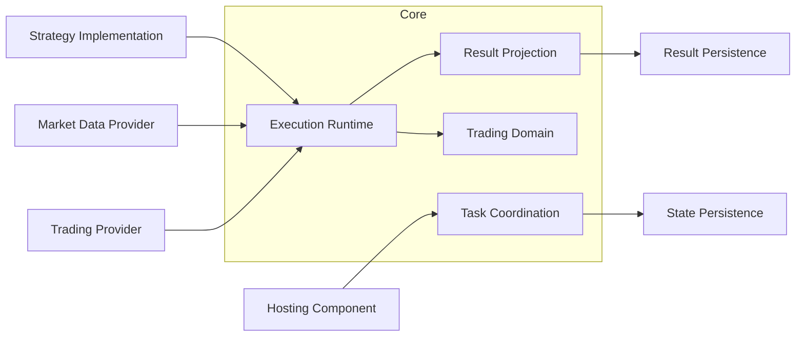
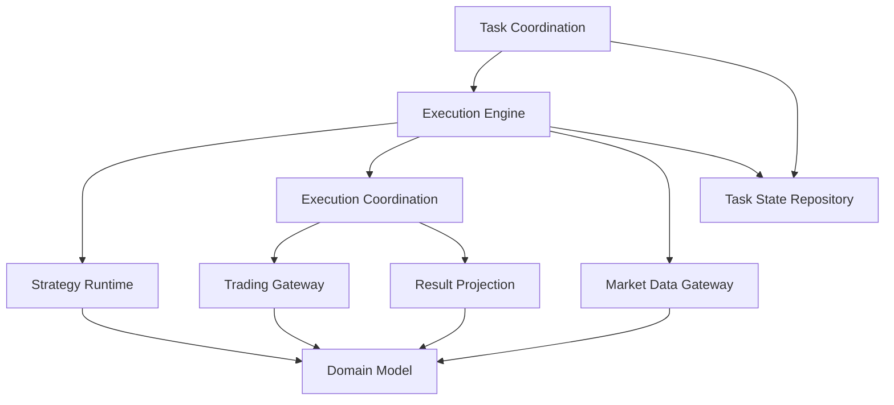
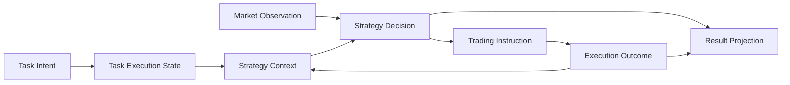
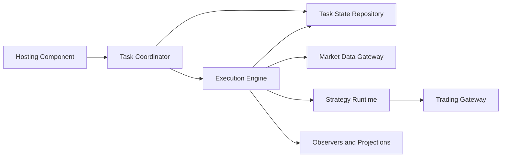
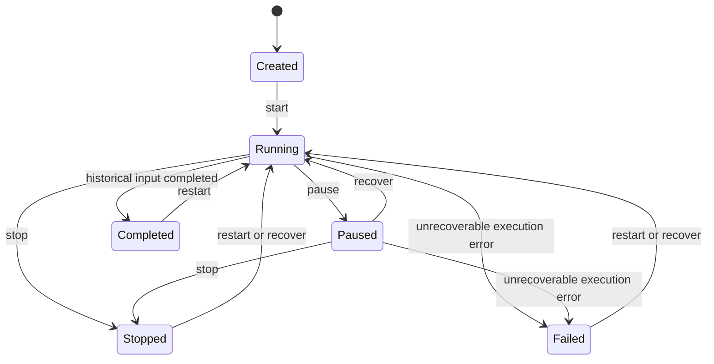
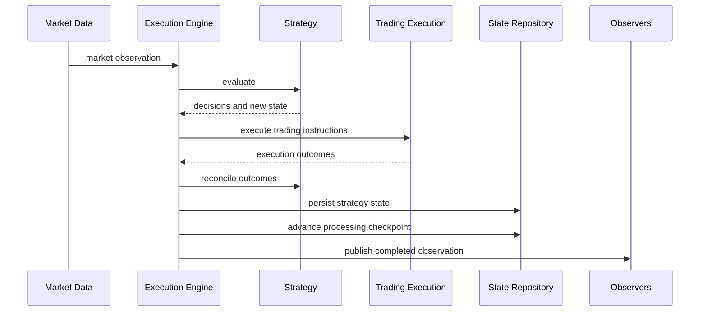
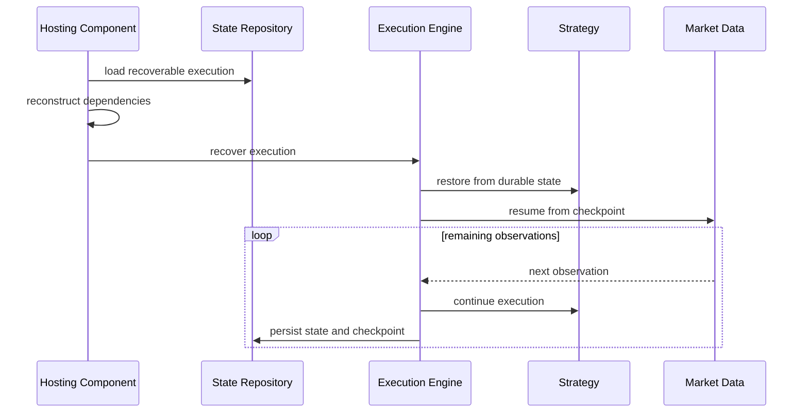
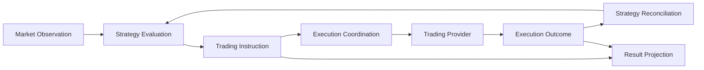
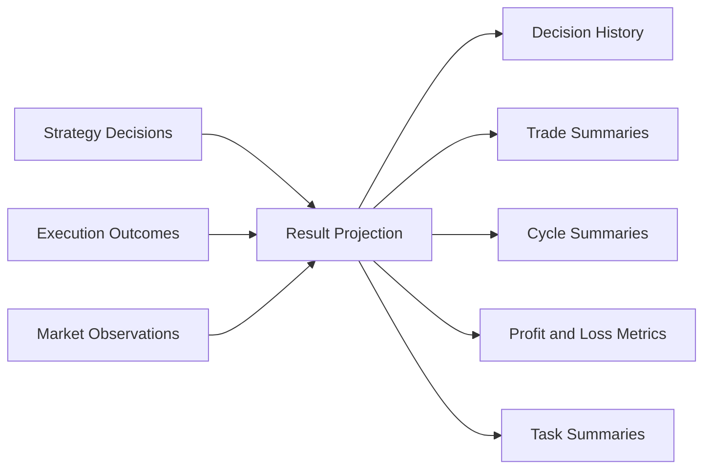
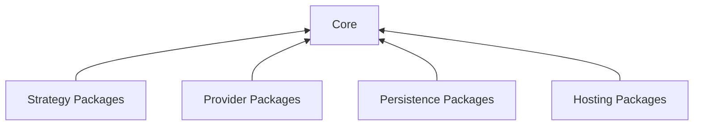

# Core High-Level Design

## Purpose

The Core package defines the provider-neutral domain and execution model shared by
backtesting and live trading. It provides the business concepts and execution
semantics required to run a trading strategy without depending on a particular
broker, transport protocol, database, operating system, or deployment model.

This document describes architectural responsibilities and boundaries. It does
not define source layout, classes, methods, serialization formats, or framework
choices.

## Scope

Core is responsible for:

- the common trading domain model;
- task definitions and task lifecycle semantics;
- strategy execution semantics;
- historical and live market-data processing;
- provider-neutral trading instructions and execution outcomes;
- task recovery semantics;
- execution results and performance projections;
- integration boundaries for market data, trading, accounts, and persistence.

Core is not responsible for:

- remote APIs or transport protocols;
- daemon and operating-system service management;
- authentication, authorization, or transport security;
- credentials and secret management;
- provider-specific communication;
- selection and configuration of concrete infrastructure;
- distributed task ownership and leader election;
- deployment topology and operational policy.

## System Context

The hosting component assembles concrete dependencies and decides when a task
should start, stop, resume, or recover. Core defines how an individual task
behaves once those decisions have been made.

## Architectural Principles

### Provider Neutrality

Trading logic operates on normalized business concepts. Provider-specific
identifiers, payloads, status codes, and communication behavior are translated
at the system boundary.

### Explicit State Ownership

The design distinguishes:

- immutable task intent;
- durable task execution state;
- durable strategy state;
- process-local runtime resources;
- analytical result projections.

This separation allows a task to be reconstructed without attempting to persist
threads, connections, or strategy objects.

### Dependency Inversion

Core defines the capabilities it requires. External packages implement those
capabilities and may depend on Core; Core does not depend on provider or hosting
packages.

### Shared Execution Semantics

Backtesting and live trading use the same strategy and trading concepts. Their
differences are confined to time, data delivery, completion conditions, and the
use of a real trading provider.

### Recovery Is Not Restart

Recovery continues the same execution from durable state. Restart begins a new
execution and intentionally discards prior progress and strategy state.

### Side Effects Follow Decisions

A strategy describes trading intent. The execution runtime is responsible for
coordinating side effects, receiving outcomes, updating state, and recording
results.

## Component View

## Contents

- [Domain Model](#domain-model)
- [Task Execution and Recovery](#task-execution-and-recovery)
- [Strategy, Events, and Orders](#strategy-events-and-orders)
- [Market Data, Results, and Extension Boundaries](#market-data-results-and-extension-boundaries)
- [Quality Attributes](#quality-attributes)

## Domain Model

### Purpose

The domain model provides a stable, provider-neutral language for trading,
backtesting, and task execution. It prevents infrastructure terminology and
unvalidated primitive values from spreading into business logic.

### Conceptual Model

### Core Concepts

#### Task Definition

A task definition describes immutable execution intent:

- task type;
- target instrument;
- strategy configuration;
- a historical time range for backtesting, or an account reference for live
  trading;
- whether live execution is simulated.

It does not identify concrete strategy code, data connections, credentials, or
infrastructure.

#### Task Execution

A task execution represents the durable state of one task:

- current lifecycle state;
- execution generation;
- lifecycle timestamps;
- latest completed processing position;
- strategy-owned state;
- failure information.

It is the primary recovery record. It contains only information that remains
meaningful after process termination.

#### Runtime Context

Runtime context combines the durable strategy state with the trading context
needed for a decision, such as the instrument and account view. Runtime-only
objects and connections are deliberately excluded from durable task state.

#### Market Observation

Market observations represent normalized prices for an instrument at an
unambiguous market time. Historical and live sources produce the same concepts,
allowing strategies to remain independent of data origin.

#### Trading Instruction

A trading instruction represents strategy intent rather than a provider call.
It contains the requested action, direction, quantity, and decision rationale.

#### Execution Outcome

An execution outcome describes what happened after a trading instruction was
submitted. It may include acceptance, rejection, fills, execution prices, and
provider-assigned references.

#### Result Projection

Result projections are analytical views derived from execution activity. They
include strategy decisions, logical trades, trading cycles, profit and loss,
and task summaries.

Result projections are not authoritative task state and are not used as the
source of task recovery.

### Identity Model

The design distinguishes three forms of identity:

- Core identities, stable within the platform;
- provider identities, assigned by an external trading system;
- logical trade identities, used to associate related open and close activity.

These identities must remain distinct. Provider identifiers may be retained for
traceability, but they do not replace platform identity.

### Value Semantics

Financial values carry their business meaning:

- monetary values include currency;
- instruments identify base and quote currencies;
- quantities are distinct from prices;
- market times are timezone-aware;
- order and task states use explicit enumerations;
- arbitrary provider information is isolated as metadata.

Invalid or ambiguous values are rejected at integration boundaries rather than
normalized deep inside strategy execution.

### State Ownership

| State | Owner | Durability |
| --- | --- | --- |
| Task intent | Task definition | Durable |
| Task lifecycle and progress | Task execution | Durable |
| Strategy decision state | Strategy | Durable |
| Connections and worker state | Execution runtime | Process-local |
| Interim account calculations | Execution runtime | Process-local unless explicitly persisted |
| Trades and performance summaries | Result projection | Durable for analysis |
| Desired operational state | Hosting component | Outside Core |

Clear state ownership is required to make recovery behavior predictable and to
avoid treating derived results as control state.

## Task Execution and Recovery

### Responsibilities

Task execution coordinates the lifecycle of a backtest or live trading task. It
connects task state, market data, strategy decisions, trading execution, and
result observation while preserving a consistent processing order.

### Execution Components

The task coordinator accepts lifecycle decisions. The execution engine owns the
ordered processing of one task. The hosting component owns process lifecycle,
dependency construction, and operational recovery policy.

### Lifecycle

The model may reserve additional transitional states for future coordination,
but normal execution is expressed by the states above.

### New Execution

A new execution follows this sequence:

1. Validate immutable task intent.
2. Create a durable execution record.
3. Construct process-local dependencies.
4. Acquire an execution slot.
5. Activate the strategy for a new execution.
6. Process market observations in order.
7. Persist strategy state and the processing checkpoint after each completed
   observation.
8. finish as completed, paused, stopped, or failed.

The execution engine prevents more than one active runtime for the same task
within a process. A strategy runtime is not shared by concurrent tasks.

### Processing Order

One task processes observations serially. The next observation is not processed
until the current decision, execution outcome, strategy reconciliation, and
state update have completed.

### Backtesting

Backtesting consumes a finite, ordered historical data set.

- logical time follows market time rather than wall-clock time;
- execution completes when the configured range is exhausted;
- deterministic input ordering is required;
- recovery resumes after the last completed historical observation.

The design favors reproducibility: the same intent, initial state, strategy,
and market observations should produce the same sequence of decisions.

### Live Trading

Live trading consumes an ongoing market stream.

- logical time follows the live environment;
- the task continues until paused, stopped, failed, or the stream terminates;
- a real trading provider is required unless execution is simulated;
- recovery reconnects to market data and ignores observations already covered
  by the durable checkpoint.

Connection management, retry backoff, and provider availability remain
integration concerns.

### Restart and Recovery

| Operation | Execution identity | Progress | Strategy state | Intended use |
| --- | --- | --- | --- | --- |
| Restart | New execution generation | Reset | Reset | Deliberately run the task again |
| Recovery | Same execution generation | Preserved | Preserved | Continue interrupted work |

Recovery activates the strategy through a recovery phase, not the normal
start phase. This prevents initialization side effects from being repeated and
allows process-local state to be reconstructed from durable strategy state.

### Recovery Sequence

Core defines the semantics of recovery. The hosting component decides:

- which tasks are intended to remain active;
- whether this process may own the task;
- how concrete dependencies are reconstructed;
- whether recovery should be retried or escalated;
- how operator-requested pause and stop states are distinguished from process
  interruption.

### Consistency Boundary

The durable processing boundary is reached after strategy state has been
reconciled and the processing checkpoint has advanced.

This boundary does not create a distributed transaction with an external
trading provider. A process may stop after the provider accepts an instruction
but before the local state records its outcome. Safe live recovery therefore
requires a separate execution journal and provider reconciliation capability.

### Concurrency Model

- Different tasks may run concurrently.
- A single task processes observations serially.
- Pause and stop are cooperative operations.
- Shared repositories and observers must support concurrent tasks.
- Distributed ownership is outside Core.

A blocking market-data or trading operation can delay cooperative shutdown.
Timeout and cancellation behavior must therefore be defined by the relevant
integration.

## Strategy, Events, and Orders

### Strategy Boundary

A strategy converts market observations and current strategy state into:

- zero or more trading instructions;
- an updated durable strategy state;
- decision rationale suitable for diagnostics and result analysis.

A strategy does not communicate directly with a provider, persist task state,
or control task scheduling.

### Strategy Lifecycle

The strategy lifecycle has five conceptual phases:

1. **Start** initializes a new execution.
2. **Recover** reconstructs runtime state for an existing execution.
3. **Evaluate** processes market observations.
4. **Reconcile** applies trading outcomes to strategy state.
5. **Stop** performs orderly completion behavior.

The start and recovery phases are intentionally separate. Recovery must not
repeat one-time initialization or opening side effects.

### Decision and Execution Flow

Execution coordination preserves the relationship between a strategy decision
and its eventual outcome. This relationship is visible to the strategy,
observers, and result projections.

### Trading Instructions

The Core domain recognizes the following categories of intent:

- take no trading action;
- open exposure;
- close exposure;
- cancel a pending order.

An instruction includes the instrument, direction, quantity, and rationale
required to understand the decision. Provider-specific order syntax is not part
of the instruction.

Not every modeled instruction must be executable by every provider or every
Core release. Unsupported capabilities must produce an explicit outcome rather
than being silently ignored.

### Trading Execution

Trading execution translates a provider-neutral instruction into a provider
operation and normalizes the response.

Opening exposure creates a new logical trade intent. Closing exposure identifies
the corresponding logical trade or current position and may produce multiple
provider operations when the provider represents exposure as multiple trades.

Execution outcomes distinguish:

- accepted but not filled;
- partially or fully filled;
- rejected;
- cancelled;
- failed because the result is unknown.

Provider references are retained for correlation and recovery without leaking
provider-specific behavior into strategy logic.

### Simulation

Simulation follows the same decision and reconciliation path as live execution,
but replaces provider interaction with a deterministic execution model.

The default simulation is intended to validate task and strategy behavior. It
must not be treated as a complete market microstructure model unless a richer
simulation component is explicitly provided.

### Event Coordination

Core uses in-process event coordination to:

- publish task lifecycle changes;
- route strategy instructions to execution;
- correlate instructions and outcomes;
- notify observers and result projections;
- report execution and observer failures.

Event coordination is ordered within a task. It is not a durable message broker
and does not provide cross-process delivery.

### Timeouts and Unknown Outcomes

An instruction may remain unresolved when the provider does not return a
definitive result. The runtime detects and reports unresolved instructions, but
timeout alone does not prove whether the provider accepted the operation.

Unknown outcomes must not be converted into automatic retries without provider
reconciliation. Retrying an unknown instruction can create duplicate exposure.

### Recovery and Effectively-Once Execution

Safe live recovery requires more than replaying market data. The architecture
must be able to answer:

- Was the instruction sent?
- Did the provider accept it?
- Was it filled, rejected, or cancelled?
- Has the outcome already been applied to strategy state?

Core currently separates decision, execution, and reconciliation but does not
provide a durable execution journal or provider reconciliation model. Therefore,
process-level recovery does not by itself guarantee exactly-once or
effectively-once trading.

A future provider-neutral recovery design should include:

- stable execution command identity;
- durable command state;
- provider transaction correlation;
- reconciliation before market processing resumes;
- fencing against an obsolete task owner.

## Market Data, Results, and Extension Boundaries

### Market Data Boundary

Core consumes provider-neutral market observations through a common boundary.
The boundary supports two execution patterns:

- finite historical replay for backtesting;
- ongoing live delivery for trading.

Both patterns produce the same domain concepts so that strategy behavior does
not depend on the source of the data.

### Historical Data

Historical data must provide:

- deterministic ordering;
- a bounded time range;
- stable interpretation of instruments and prices;
- replay behavior compatible with the durable processing checkpoint.

Backtest recovery assumes that the source can reproduce the remaining sequence
after an interruption.

### Live Data

Live data must provide:

- ordered delivery within the needs of a task;
- explicit snapshot and streaming semantics;
- reconnection behavior;
- a way to distinguish already-processed data from new data;
- resource cleanup on shutdown.

Provider-specific heartbeat, reconnect, and rate-limit behavior remains outside
Core.

### Time Model

Core distinguishes:

- **market time**, carried by market observations;
- **execution time**, used for task lifecycle and live operation;
- **simulated time**, advanced by historical replay.

Backtesting uses simulated time so that lifecycle behavior follows the historical
scenario. Live trading uses execution time while retaining market time for each
observation.

### Result Projection

Result projection transforms execution activity into read-optimized analytical
views. It is intentionally separate from task control state.

The result model supports:

- decision history;
- logical trade lifecycle;
- grouped trading cycles;
- realized and unrealized profit and loss;
- task-level completion summaries.

### Persistence Boundaries

Task state and analytical results have different consistency and retention
requirements.

| Boundary | Purpose |
| --- | --- |
| Task state persistence | Lifecycle control, recovery, strategy state, processing progress |
| Result persistence | Analysis, reporting, audit views, performance measurement |

A deployment may use the same database for both, but the logical responsibilities
must remain separate. Analytical results are not used to reconstruct the
authoritative execution state.

### External Capabilities

Core defines abstract capabilities for:

- market data;
- trading execution;
- account information;
- durable task state;
- result persistence;
- execution observation.

External packages adapt concrete providers and infrastructure to these
capabilities.

### Extension Rules

#### Strategies

A strategy extension owns trading policy and durable decision state. It must
remain independent of provider protocols and hosting concerns.

#### Market Data Providers

A market-data extension owns provider communication, normalization, ordering,
reconnection, and resource management.

#### Trading Providers

A trading extension owns provider communication, status normalization,
provider identity mapping, retry policy, and transaction lookup.

#### Persistence Providers

A task-state extension must preserve task identity, lifecycle state, strategy
state, and processing progress. A result extension stores analytical projections
without becoming part of task coordination.

#### Observers

Observers may add metrics, traces, notifications, or projections. They must not
silently change task or strategy behavior.

### Dependency Direction

Concrete registrations, credentials, connection settings, and deployment
configuration belong to the hosting layer. Core must not import or discover
external implementations by name.

### Capability Boundaries

Optional capabilities must be explicit. Examples include candle delivery,
provider-side idempotency, transaction replay, and advanced simulation.

An integration must report unsupported capabilities clearly. Empty results or
silent fallback must not be used when they could change trading behavior.

## Quality Attributes

### Correctness

Correctness takes priority over permissive input handling.

- financial values retain currency and quantity semantics;
- timestamps are unambiguous;
- task transitions are explicit;
- strategy decisions are correlated with execution outcomes;
- invalid provider data is rejected at the integration boundary;
- derived analytical results do not replace authoritative task state.

### Determinism

Backtesting should be reproducible for the same task intent, initial state,
strategy, and ordered market data.

Determinism depends on:

- simulated time;
- serial processing within a task;
- explicit durable strategy state;
- stable market-data ordering;
- deterministic simulation behavior;
- controlled use of randomness.

Strategies that use randomness must make the seed part of explicit configuration
or durable state.

### Reliability and Recovery

Recovery must preserve:

- task identity;
- execution generation;
- strategy state;
- processing progress;
- the distinction between recovery and restart.

Recovery is complete only when process-local dependencies have been reconstructed
and the strategy can continue from durable state.

Live trading recovery additionally requires provider reconciliation. Until that
capability exists, unknown execution outcomes require conservative handling and
may require operator intervention.

### Concurrency

Concurrency is task-oriented:

- multiple tasks may execute concurrently;
- one task processes observations serially;
- strategy runtime state is not shared between active tasks;
- shared persistence and observation components support concurrent access;
- pause and stop are cooperative.

Distributed concurrency control is outside Core and must be supplied by the
hosting architecture.

### Scalability

Core is designed for bounded in-process concurrency rather than distributed
execution.

Primary scaling factors include:

- number of concurrent tasks;
- market observation rate;
- strategy evaluation cost;
- trading-provider latency;
- observer and result-persistence latency.

Slow synchronous integrations can delay a task. Queueing, asynchronous provider
calls, and backpressure require explicit architectural design because they can
change ordering and recovery semantics.

### Observability

Core exposes provider-neutral operational signals for:

- task lifecycle;
- strategy decisions;
- trading outcomes;
- failures and unresolved operations;
- task progress;
- execution performance;
- trade and profit projections.

The hosting component maps these signals to logging, metrics, tracing, alerting,
and audit infrastructure.

Observability data must preserve task and execution identity without exposing
credentials or sensitive provider configuration.

### Security

Core does not own authentication, authorization, encryption, certificates, or
secret storage.

It minimizes security exposure by:

- keeping credentials outside task definitions;
- representing accounts by references rather than secrets;
- preventing provider payloads from becoming the domain model;
- requiring external integrations to remove sensitive metadata before it enters
  logging or persistence.

### Compatibility

Core is the shared semantic boundary for multiple packages. Changes to task
lifecycle, strategy state, trading instructions, or recovery semantics must be
treated as architectural changes and updated consistently across all adapters
and consumers.

Backward compatibility is not assumed at the current stage of development.
Obsolete concepts should be removed rather than retained as parallel contracts.

### Test Strategy

Testing is divided by architectural scope.

#### Unit Tests

Unit tests verify isolated domain rules, state transitions, decision handling,
normalization, and projection behavior.

#### Integration Tests

Integration tests verify collaboration among Core components, including:

- strategy decisions through trading outcomes;
- task execution through durable state updates;
- market data through strategy evaluation;
- execution activity through result projection;
- interruption through recovery.

External systems are replaced with controlled test implementations.

#### End-to-End Tests

Core end-to-end tests exercise complete scenarios through the public Core
boundary:

- historical task completion;
- simulated trading decisions and outcomes;
- pause and recovery;
- process reconstruction from durable state;
- failure and final result projection.

Provider-specific end-to-end scenarios belong to provider or hosting packages,
not Core.
